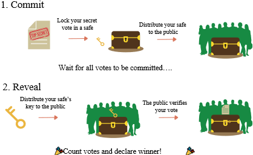

# Prove-of-Work-and-Merkle-Trees
Repository containing a blockchain project regarding prove of work and a commitment scheme using Merkle Trees

This repository contains the following files:

- GenerateCoin.py: This file will generate a file called coin.txt that contains a valid coin. Valid coins have the following characteristics:
  * The first 10 bits of each coin are called its watermark
  * Each coin consists of 4 64-bit strings
  * All of the 64-bit strings hash to strings that have their first 28 bits equal. The hash function used is SHA-256

- ForgeWatermark.py: Forges a watermark for a valid coin. Creates a valid coin from another coin with another watermark. This watermark is stored in forged-watermark.txt

- merkle.py: Contains the Prover class, which implements a commitment scheme based on Merkle trees. It has the following functions:
  * build_merkle_tree: given a list of strings, builds a merkle tree with the strings as their leaf values and returns the commitment (the hash of the root of the tree)
  * generate_proof: given a leaf of the tree, returns the path from the leaf to the root
  * verify: given an object, verifies if the object is present in the tree

Documentation

Here is some useful background information for the understanding of this project.

Commitment scheme

A commitment scheme is a cryptographic primitive that allows one to commit to a chosen value (or chosen statement) while keeping it hidden to others, with the ability to reveal the committed value later. Commitment schemes are designed so that a party cannot change the value or statement after they have committed to it: that is, commitment schemes are binding. Commitment schemes have important applications in a number of cryptographic protocols including secure coin flipping, zero-knowledge proofs, and secure computation.

Merkle trees

A hash tree or Merkle tree is a tree in which every "leaf" (node) is labelled with the cryptographic hash of a data block, and every node that is not a leaf (called a branch, inner node, or inode) is labelled with the cryptographic hash of the labels of its child nodes. A hash tree allows efficient and secure verification of the contents of a large data structure. A hash tree is a generalization of a hash list and a hash chain.

